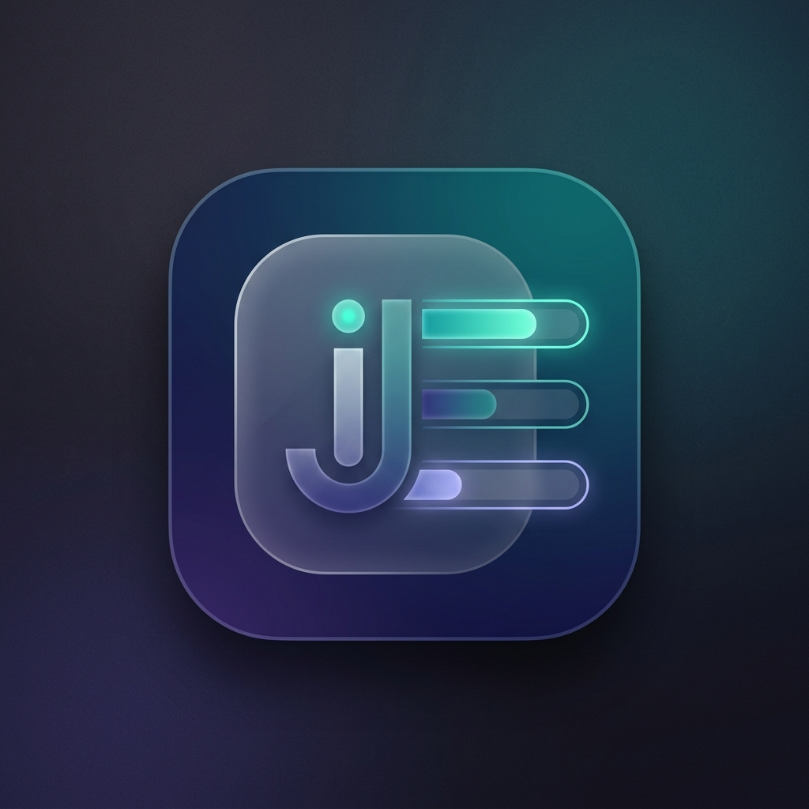

<div align="center">
  
  <h1>💼 Intern Job (formerly InternHub)</h1>
  <p>A modern, premium, and scalable Flutter application for streamlined intern task management, progress tracking, and seamless collaboration.</p>

  [](https://flutter.dev/)
  [](https://firebase.google.com/)
  [](https://dart.dev/)
  [](https://opensource.org/licenses/MIT)
</div>

<br/>

## 📖 Overview

**Intern Job** is a role-based task management system specifically tailored to bridge the gap between administrators (mentors) and interns. Built with a focus on **UI/UX excellence**, it features a beautiful custom-designed theme, smooth micro-interactions, real-time data sync, and interactive analytics powered by advanced charting libraries.

---

## ✨ Key Features

### 🛡️ Role-Based Access Control
| Role | Capabilities |
| :--- | :--- |
| **Administrator** | Get a bird's-eye view of all interns, manage global task distribution, track overall progress metrics, and oversee the entire internship cohort. |
| **Intern** | Access a personalized workspace to view assigned tasks, update real-time task statuses, and track personal completion rates. |

### ⚡ Real-Time Task Management
- Create, assign, and track tasks instantly using **Firebase Cloud Firestore**.
- Assign strict deadlines and visually highlight overdue or critical tasks.
- Integrated **Real-Time Comments** on task details for seamless mentor-intern collaboration.

### 🎨 Premium UI/UX & Animations
- **Modern Aesthetic:** Deep Indigo and Teal color palette with subtle gradients, soft shadows, and rounded glassmorphism-inspired cards.
- **Dynamic Dark Mode:** Fully functional, deeply integrated dark and light themes that can be toggled smoothly from the app drawer.
- **Micro-Interactions:** Staggered list animations, Hero transitions for task details, and beautifully crafted Shimmer loading effects.
- **Custom Branding:** Polished "Made by withshafan" graphics elegantly integrated into the application interface.

### 📊 Data Visualization with `fl_chart`
Instead of static representations, **Intern Job** heavily relies on dynamic data visualization using **`fl_chart`** to provide real-time insights:
- **Dynamic Pie Charts:** Visualize task completion rates and intern distributions with interactive, animated pie charts.
- **Progress Tracking:** Monitor intern performance over time through intuitive graphical representations.
- **Real-time Updates:** Charts automatically re-render with smooth animations whenever backend data in Firestore is updated, providing a truly reactive analytics dashboard.

---

## 🛠️ Technology Stack

- **Framework:** [Flutter](https://flutter.dev/) (Dart)
- **Backend & Database:** [Firebase](https://firebase.google.com/) (Auth, Firestore, Storage)
- **State Management:** [Provider](https://pub.dev/packages/provider) (using `MultiProvider` architecture)
- **Data Visualization:** `fl_chart` 
- **Typography & UI:** `google_fonts`, `flutter_staggered_animations`, `shimmer`

---

## 📁 Project Structure

```text
lib/
├── main.dart                 # App entry point & Global MultiProvider setup
├── firebase_options.dart     # Firebase configuration
├── models/                   # Data models (AppUser, Task, TaskComment)
├── providers/                # State management (AuthProvider, TaskProvider, ThemeNotifier)
├── screens/                  # UI Screens
│   ├── splash_screen.dart    # Animated loading & auth routing
│   ├── login_screen.dart     # User login & authentication
│   ├── signup_screen.dart    # User registration (Role selection)
│   ├── home_screen.dart      # Main dashboard with bottom navigation
│   ├── tasks_screen.dart     # Task list with filtering
│   ├── create_task_screen.dart # Form to assign/create tasks
│   ├── task_detail_screen.dart # Detailed view & comment stream
│   └── progress_screen.dart  # Charts and analytics view (`fl_chart`)
├── services/                 # API & Firebase logic
│   ├── auth_service.dart
│   ├── user_service.dart
│   ├── task_service.dart
│   └── notification_service.dart
├── theme/                    # Design System
│   └── app_theme.dart        # Custom light/dark themes & design tokens
└── widgets/                  # Reusable UI components
    ├── app_drawer.dart       # Custom navigation drawer with branding
    └── task_card.dart        # Premium task list item
```

---

## 🚀 Getting Started

### Prerequisites
- Flutter SDK (v3.10.0 or higher)
- Dart SDK
- Android Studio / VS Code
- A Firebase project configured for Android and iOS

### Installation

1. **Clone the repository:**
   ```bash
   git clone https://github.com/withshafan/intern_job_portal.git
   cd intern_job_portal
   ```

2. **Install dependencies:**
   ```bash
   flutter pub get
   ```

3. **Configure Firebase:**
   Ensure you have your `google-services.json` (Android) and `GoogleService-Info.plist` (iOS) in their respective directories, or rely on the generated `firebase_options.dart` if using FlutterFire CLI.

4. **Run the app:**
   ```bash
   flutter run
   ```

---

## 🤝 Contributing
Contributions, issues, and feature requests are welcome! Feel free to check the [issues page](https://github.com/withshafan/intern_job_portal/issues).

## 📄 License
This project is licensed under the MIT License.

---
<div align="center">
  <sub><b>Made with ❤️ by withshafan</b></sub>
</div>
